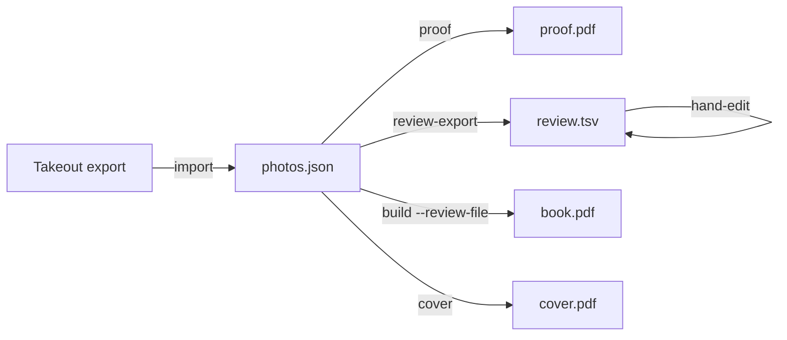

# photobook

**photobook** turns a Google Takeout export of a Google Photos album into
a print-ready hardcover photo book PDF, sized for [Blurb's](https://www.blurb.com)
Standard Landscape (8x10) ImageWrap hardcover.

It's a command-line tool, not a service: everything runs locally, on
your own export, with no photos ever leaving your machine.

## What it does

- Scans a Takeout export and matches each photo to its metadata (caption,
  timestamp, GPS location), handling Takeout's edited-photo and
  duplicate-filename quirks along the way.
- Lays out photos into a book: panoramas get their own full-bleed page,
  everything else fills grid pages of mostly 4-5 photos (occasionally
  2). Every photo is shown at its own aspect ratio, never cropped.
- Optionally groups photos into chapters by country (reverse-geocoded
  from GPS data), each with its own divider page.
- Optionally exports an editable **review file** — a plain TSV listing
  every photo in book order, with a single caption column (a lightweight
  parenthesized convention marks a value as a reference note rather than
  a real caption) and controls for chapter boundaries and
  forcing/preventing solo pages — so you can correct the book's order,
  captions, and structure by hand before the final build.
- Renders everything with real embedded fonts (bundled [EB Garamond](https://github.com/googlefonts/EBGaramond))
  and verifies image resolution meets Blurb's ~300 PPI print guidance.
- Generates a matching Hardcover ImageWrap cover PDF from two photos you
  choose, sized to Blurb's exact spec for your book's page count.

## The pipeline



The [Workflow](workflow.md) page walks through this end to end. The
[CLI reference](cli-reference.md) documents every command and flag, and
the [Review file format](review-file-format.md) page documents the
review.tsv columns in detail.

## Quick start

```sh
uv run photobook import "My Takeout Album" -o build
uv run photobook review-export build/photos.json -o build/review.tsv
# ...edit build/review.tsv...
uv run photobook build build/photos.json --review-file build/review.tsv
uv run photobook cover build/photos.json --front IMG_1234.jpg --back IMG_5678.jpg \
                        --interior build/book.pdf
```

See [Installation](installation.md) to get set up first.
